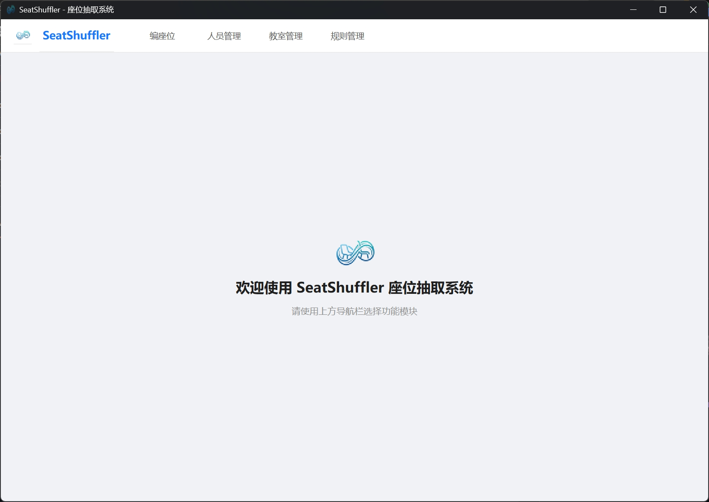
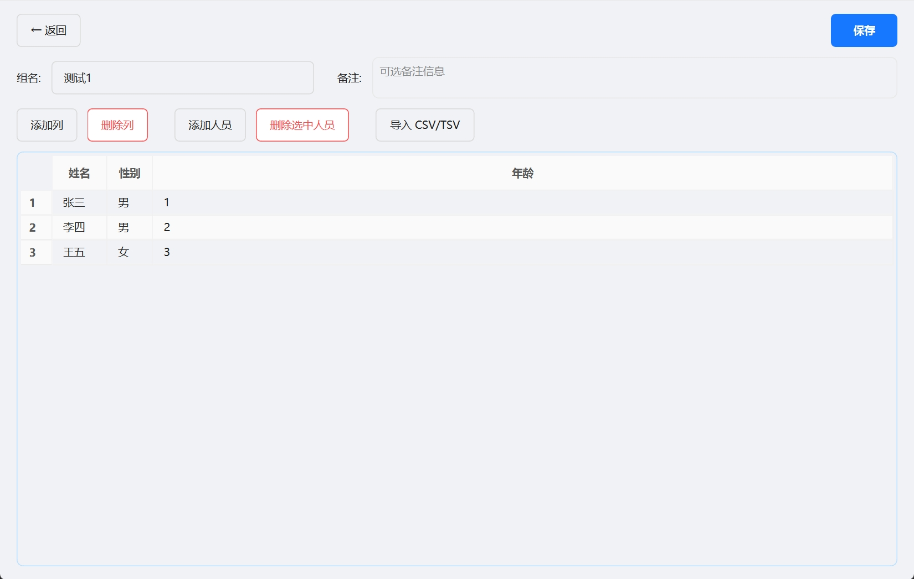
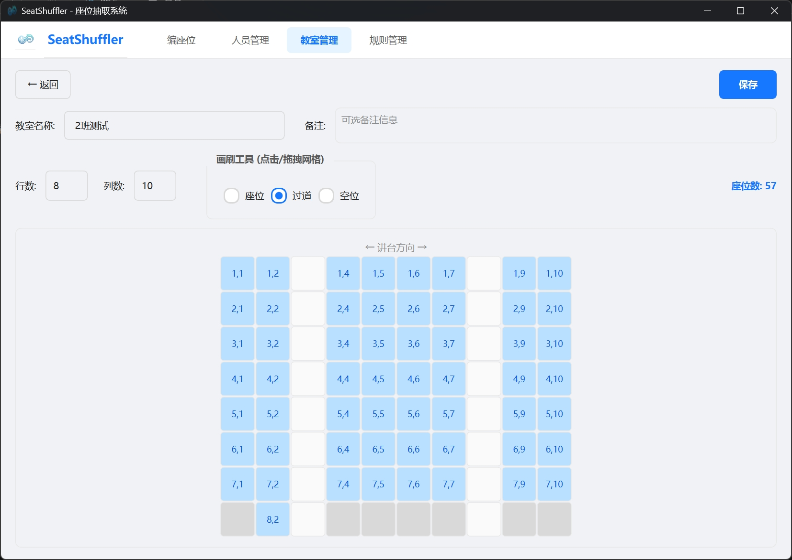
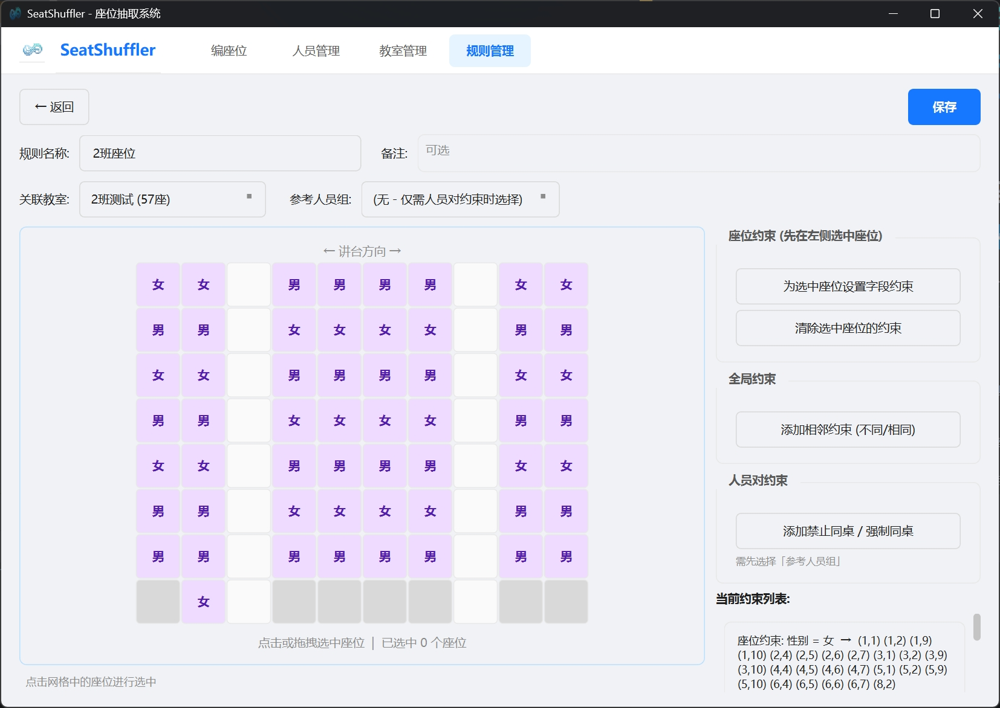
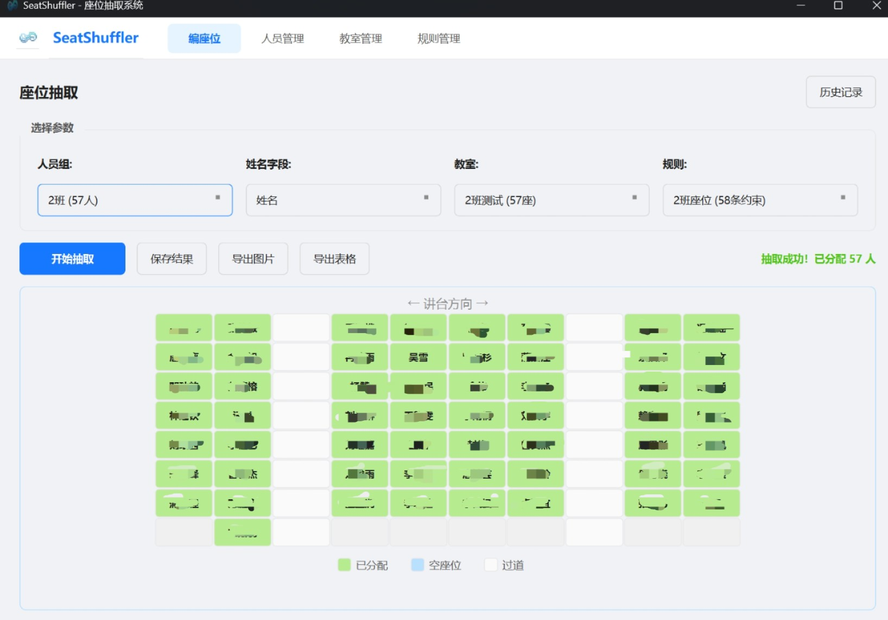

<div align="center">


# SeatShuffler

**智能座位抽取系统 —— 让排座不再是烦恼**

<p>
  
  
  
  
  
</p>

</div>

---

## 📖 简介

**SeatShuffler** 是一款基于 Qt6 / C++20 开发的桌面端座位随机分配工具。

在日常生活办公场景中，排座位往往需要兼顾性别交叉、特殊学生固定座位等多种复杂需求。SeatShuffler 通过**可视化规则编辑**和**约束回溯算法**，让原本繁琐的排座工作变得一键搞定。

> 🎯 **告别公平性争议，让排座位变得简单、透明、有趣。**

---

## 🖼️ 界面预览

|                         **首页**                         | **人员管理** |
|:------------------------------------------------------:|:---:|
|       |  |
|                        **教室管理**                        | **可视化规则编辑** |
|       |  |
|                        **座位抽取**                        | |
|  | |

---

## ✨ 功能特性

### 🎯 核心功能

- [x] **智能座位抽取** — 基于回溯算法 + 预分配优化
- [x] **可视化规则编辑** — 在教室网格上点选/拖拽座位，批量设置约束
- [x] **多种约束类型** — 座位指定、性别交叉、区域限制、行模式等
- [x] **人员对约束** — 禁止同桌 / 强制同桌，精确控制特定人物的位置关系
- [x] **结果导出** — 支持导出为 PNG 图片和 CSV 表格
- [x] **历史记录** — 每次抽取结果可保存、回看、对比
- [x] **CSV 导入** — 从 Excel 导出的 CSV/TSV 一键导入人员名单

### 🚀 计划中的功能

- [ ] **暗色主题** — 护眼暗色模式，一键切换
- [ ] **自定义存储路径** — 自由选择数据文件保存位置
- [ ] **多语言支持** — i18n 国际化，支持中文 / English 等多语言

---

## 🏗️ 项目架构

```
SeatShuffler/
├── main.cpp                          # 程序入口
├── CMakeLists.txt                    # 构建配置
├── resources.qrc                     # Qt 资源文件
├── resources/                        # 静态资源 (Logo、截图等)
│
├── src/
│   ├── models/                       # 数据模型层
│   │   ├── Classroom.h               #   教室 (二维网格)
│   │   ├── PersonGroup.h             #   人员组 (自定义列 + 人员数据)
│   │   ├── Rule.h                    #   规则 (8 种约束类型)
│   │   └── ShuffleRecord.h           #   抽取记录快照
│   │
│   ├── engine/                       # 核心算法层
│   │   ├── ShuffleEngine.h           #   抽取引擎接口
│   │   └── ShuffleEngine.cpp         #   预分配 + 回溯求解
│   │
│   ├── storage/                      # 数据持久化层
│   │   ├── DataManager.h             #   单例管理器接口
│   │   └── DataManager.cpp           #   JSON 文件 CRUD
│   │
│   └── ui/                           # 界面层
│       ├── common/
│       │   ├── Common.h              #     公共工具 (UUID、时间戳)
│       │   └── AppStyle.h            #     全局 QSS 样式 + 按钮工具
│       │
│       ├── widgets/
│       │   ├── ClassroomGridWidget   #     教室网格编辑控件
│       │   ├── ResultGridWidget      #     抽取结果展示控件
│       │   └── SeatRuleGridWidget    #     规则编辑多选网格控件
│       │
│       └── page/
│           ├── MainWindow            #     主窗口 (导航 + 页面栈)
│           ├── ShufflePage           #     座位抽取页
│           ├── PersonGroupListPage   #     人员组列表页
│           ├── PersonGroupDetailPage #     人员组编辑页
│           ├── ClassroomListPage     #     教室列表页
│           ├── ClassroomEditorPage   #     教室布局编辑页
│           ├── RuleListPage          #     规则列表页
│           ├── RuleEditorPage        #     可视化规则编辑页
│           ├── HistoryPage           #     历史记录列表页
│           └── HistoryDetailPage     #     历史记录详情页
```

---

## 🔧 约束类型一览

| 约束类型 | 说明 | 示例 |
|:---|:---|:---|
| **指定座位** | 某座位的某字段必须为某值 | 座位(7,10) 的姓名 = 张强 |
| **行模式** | 整行按模式串分配 | 第1行: 女 女 _ 男 男 男 男 _ 女 女 |
| **相邻不同** | 同行相邻座位的某字段不能相同 | 相邻座位性别不同 (空值自动跳过) |
| **相邻相同** | 同行相邻座位的某字段必须相同 | 相邻座位性别相同 |
| **指定列** | 某列所有座位的某字段必须为某值 | 第1列全部为女 |
| **区域约束** | 矩形区域内座位的某字段必须为某值 | 左前区域全部为男 |
| **禁止同桌** | 两个特定人员不能坐相邻座位 | 张三 和 李四 不能同桌 |
| **强制同桌** | 两个特定人员必须坐相邻座位 | 王五 和 赵六 必须同桌 |

---

## 📦 构建与运行

### 环境要求

| 依赖 | 版本要求 |
|:---|:---|
| Qt | 6.9+ |
| C++ | C++20 |
| 编译器 | MinGW 13+ / MSVC 2022+ |
| CMake | 3.31+ |

### 构建步骤

```bash
# 1. 克隆仓库
git clone https://github.com/RahabHub/SeatShuffler.git
cd SeatShuffler

# 2. 配置 CMakeLists.txt 中的 Qt 路径
#    修改 CMAKE_PREFIX_PATH 为你的 Qt 安装路径

# 3. 构建
cmake -B build -G "MinGW Makefiles"
cmake --build build

# 4. 运行
./build/SeatShuffler.exe
```

> 💡 **推荐使用 CLion** 直接打开项目，配置好 Qt 路径后一键构建运行。

### 数据存储位置

程序数据以 JSON 文件形式存储在：

```
Windows: C:/Users/<用户名>/AppData/Roaming/SeatShuffler/SeatShuffler/
```

```
├── person_groups/    # 人员组数据
├── classrooms/       # 教室布局数据
├── rules/            # 规则数据
└── records/          # 抽取历史记录
```

---

## 🤝 贡献

欢迎提交 Issue 和 Pull Request！

1. Fork 本仓库
2. 创建你的特性分支：`git checkout -b feature/your-feature`
3. 提交更改：`git commit -m 'Add some feature'`
4. 推送到分支：`git push origin feature/your-feature`
5. 提交 Pull Request

---

## 📄 License

本项目基于 [MIT License](LICENSE) 开源。

---